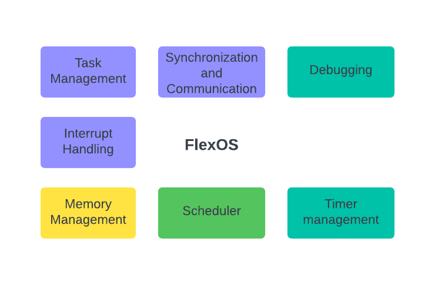

# FlexOS
FlexOS is a lightweight Real-Time Operating System (RTOS) designed for microcontrollers, featuring a preemptive task scheduler. FlexOS provides efficient task management, prioritization, and scheduling, ensuring that critical processes are handled with real-time responsiveness. Its minimal footprint makes it ideal for resource-constrained embedded systems.

🚧 Under Development
FlexOS is currently under development. Expect feature enhancements and potential bugs. Please report any issues encountered.

# Features
Preemptive Priority-Based Scheduling: Tasks can be assigned different priorities, allowing higher-priority tasks to preempt lower-priority ones for real-time performance.
Task Delay Support: Tasks can be delayed for a specified number of ticks, enabling timed execution.
Time Slicing: Round-robin scheduling between tasks of the same priority ensures fairness.
Lightweight: Designed to be resource-efficient for systems with limited memory and processing power.
Simple API: FlexOS offers an easy-to-use interface for developers to create tasks and manage scheduling.
# Installation
Clone the repository:
    git clone https://github.com/mayankpatel97/FlexOS-RTOS.git
# Usage
    #include "flexos.h"

    // Define your tasks
    void task1() {
        while (1) {
            // Task 1 code
        }
    }

    void task2() {
        while (1) {
            // Task 2 code
        }
    }

    void task3() {
        while (1) {
            // Task 3 code
        }
    }

    int main(void) {
        // Initialize the HAL and system clock
        HAL_Init();
        SystemClock_Config();

        // Initialize tasks with different priorities
        tm_startTask(0, task1);  // Task 1: Low priority
        tm_startTask(1, task2);  // Task 2: Medium priority
        tm_startTask(2, task3);  // Task 3: High priority

        // Start the preemptive scheduler
        tm_startSched();

        // Main loop (may handle background or low-priority operations)
        while (1) {
        }
    }

# API Reference
tm_startTask(int priority, void (*taskFunc)(void)): Registers a task with a specific priority (higher number = higher priority).
tm_startSched(): Starts the preemptive task scheduler, enabling task switching and priority-based scheduling.
tm_tick_handler(): Scheduler tick handler for time slicing and task switching, typically triggered by a timer interrupt.
taskDelay(uint32_t ticks): Delays the current task by a specific number of ticks.

# Block Diagram

# Contributing
Contributions are welcome! To contribute to FlexOS, please follow these steps:

Fork the repository.
Create a new branch (git checkout -b feature/YourFeature).
Commit your changes (git commit -m 'Add new feature').
Push to the branch (git push origin feature/YourFeature).
Open a pull request.

# License
This project is licensed under the MIT License. See the LICENSE file for details.